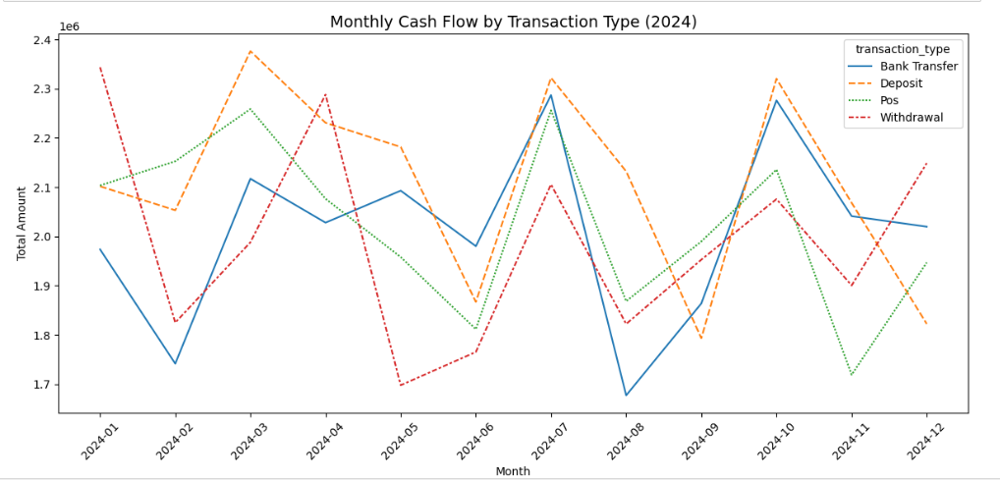

# Banking Data EDA & Insights: Transaction Trends, Volumes, and Customer Activity

## 📑 Data Source
- Dataset Available

## 🛠️ Tools Used
- Python (Pandas, Matplotlib, Seaborn)
- Jupyter Notebook
- Excel

## Data Preparations
1) Changed the data type of transaction_date to datetime from object(pd.to_datetime function).
2) Dealt with negative amounts in amount column by maing the values positive.
3) Filled null values in amount column with the mean of the column.
4) Dropped nulls in transaction_date and transaction_type column.
5) Checked for duplicate rows(144) and dropped them.
6) Normalized the transaction_type column by making sure entries are same ie Withdrawal, WITHDRAWAL , Pos, POS etc

## 📈 Key Analytical Objectives
1. What is the monthly cash flow?
2. What is the distribution across all transaction types.
3. Who are the outliers?
4. Who are top 10 customers in transactions?
5. What transactions are physical or digital?

## 📊 Key Findings

### Monthly Cash Flow by Transaction Type (2024)

- 2024 transaction activity shows strong seasonality. Deposits and transfers reflect predictable cycles, while withdrawals are more volatile. POS usage steadily rises over the year, indicating increased digital adoption. July and October represent peak customer activity, creating opportunities for strategic outreach, liquidity planning, and operational optimization. 

### Distribution of Transaction Types
- Across the 2024 dataset, customer behavior shows a healthy balance across all transaction types(Deposit: 2,443, POS: 2,389, Bank Transfer: 2,373, Withdrawal: 2,352), with deposits being the most common and withdrawals slightly lower. The strong volume of POS transactions highlights increasing digital payment adoption, while the consistent use of bank transfers underscores active account-to-account movement. Overall, the transaction mix suggests an engaged and digitally adapting customer

### Outliers
- The transaction amount distribution shows strong right-skewness with many legitimate high-value outliers. While most transactions fall under the typical bank activity range, a small number of large payments represent critical customer segments such as businesses or high-value clients. These transactions may warrant closer monitoring for compliance and risk management but also highlight opportunities for premium financial services.

### Top 10 Customers
- The top 10 customers collectively contribute a significant portion of total transaction value, with the highest customer (CUST1233) transacting over 208k in 2024. This concentration of high-value activity highlights a key customer segment that could benefit from specialized services, loyalty programs, and strategic relationship management. These customers likely represent businesses or high-income individuals whose activity patterns drive major cash flow through the bank.

### Digital vs. Physical Transactions 
- The bank’s transaction activity is heavily skewed toward physical channels, with 75% of all transactions occurring at branches, ATMs, or POS. Digital channels account for only 25%, indicating low digital adoption relative to modern industry standards. This reliance on physical infrastructure increases operational costs and highlights a significant opportunity for digital transformation through customer education, incentives, and improved digital user experience.

