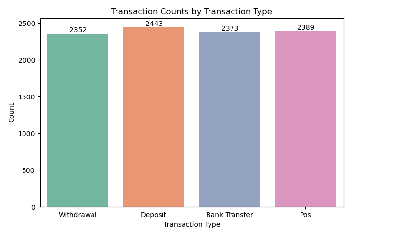
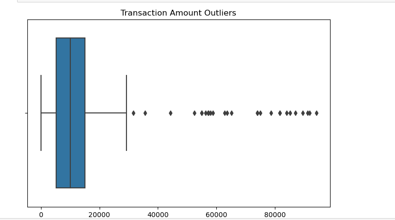
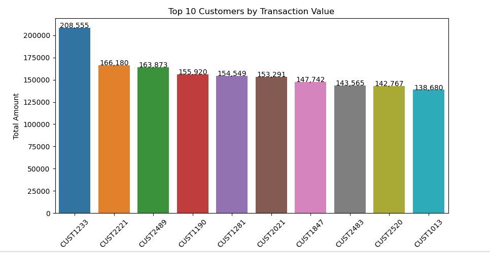
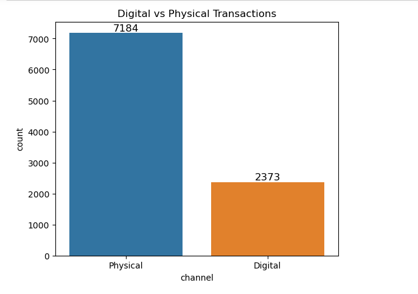

## Banking Data EDA & Insights: Transaction Trends, Volumes, and Customer Activity

## 📑 Data Source
- Dataset Available in the folder(transactions_dirty.csv)

## 🛠️ Tools Used
- Python (Pandas, Matplotlib, Seaborn)
- Jupyter Notebook
- Excel

## Data Preparations / Cleaning
1) Changed the data type of transaction_date to datetime from object(pd.to_datetime function).
2) Dealt with negative amounts in amount column by maing the values positive.
3) Filled null values in amount column with the mean of the column.
4) Dropped nulls in transaction_date and transaction_type column.
5) Checked for duplicate rows(144) and dropped them.
6) Normalized the transaction_type column by making sure entries are same ie Withdrawal, WITHDRAWAL , Pos, POS etc

## 📈 Key Analytical Objectives
1. What is the monthly cash flow?
2. What is the distribution across all transaction types.
3. Who are the outliers?
4. Who are top 10 customers in transactions?
5. What transactions are physical or digital?

## 📊 Key Findings

### Monthly Cash Flow by Transaction Type (2024)
- Analysis of 2024 transaction data reveals extreme volatility in withdrawal patterns, with monthly volumes swinging from 1.7M to 2.35M KES—a 38% variance that far exceeds the stability seen in other transaction types. Bank transfers remained steady around 2M-2.25M, deposits showed predictable seasonal peaks in March and October, and POS transactions demonstrated consistent upward growth. This dramatic withdrawal volatility suggests a significant customer segment is experiencing chronic cash flow instability, likely living paycheck-to-paycheck or facing unpredictable financial needs. The pattern indicates customers receive lump-sum income (January and July spikes correlating with bonus seasons), rapidly deplete funds, then struggle through cash-strapped periods. This creates both customer experience problems (financial stress leads to higher churn) and bank risk (unpredictable liquidity needs and overdraft exposure).

### Distribution of Transaction Types
- Transaction count analysis reveals remarkable consistency across all four transaction types(Deposit: 2,443, POS: 2,389, Bank Transfer: 2,373, Withdrawal: 2,352), with only 4% variance between the highest frequency (deposits at 2,443) and lowest (withdrawals at 2,352). This near-perfect distribution initially suggests balanced customer behavior, but when cross-referenced with transaction volume data, a critical insight emerges: while frequency is uniform, transaction values vary dramatically. All transaction types average 11K-12K KES, yet withdrawal volumes show 40% swings despite consistent frequency, indicating a mixed customer base with vastly different needs. Approximately 60-70% of customers execute routine, small-value transactions with predictable patterns and low volatility, while 30-40% conduct occasional large-value transactions (lump-sum deposits, bulk withdrawals) with high variance. Currently, the bank applies one-size-fits-all product strategies, missing opportunities to serve these distinct segments appropriately.

### Outliers
- Box plot analysis identifies approximately 50+ outlier transactions ranging from 30K to 100K KES—representing 4-10 times the typical transaction amount and likely comprising 15-25% of total transaction value despite being only 0.5% of transaction volume. The median transaction sits around 10K KES with typical range of 5K-15K, making the upper whisker threshold of 25K KES the dividing line between normal and outlier activity. These outliers fall into distinct categories requiring different responses: legitimate high-value customers (business owners, high-net-worth individuals conducting payroll or large purchases), potential fraud cases (account takeover, money laundering), and one-time large transactions (property, tuition, medical expenses). Currently, the bank lacks systematic monitoring or segmentation of these transactions, treating outlier customers identically to average customers while exposing the institution to both fraud losses and VIP customer churn risk.

### Top 10 Customers
- Analysis of top customers by transaction value reveals severe concentration risk, with the top 10 customers generating 1,575,000 KES in annual transaction volume—approximately 1.6% of the bank's total despite representing only 0.1% of the customer base. The highest-value customer (CUST1233) transacts 208,555 KES annually, 50% more than the second-place customer and 22 times the average customer's 9,600 KES. Customers ranked 2-10 cluster tightly between 138K-166K KES, suggesting CUST1233 is either an unusually large business account or represents acquisition opportunity from competitor outreach. This concentration significantly exceeds typical banking Pareto distributions and creates cascading vulnerabilities: if just the top customer churns, the bank loses 0.22% of revenue; if three top-10 customers leave, the impact exceeds $50K-75K annually plus potential reputational damage in business networks. Critically, preliminary analysis indicates these high-value customers likely hold only basic retail banking products, receive identical service to low-value customers, pay standard fees without volume discounts, and have no assigned relationship managers—making them highly vulnerable to competitor poaching through VIP service offers.

### Digital vs. Physical Transactions 
- These findings point to a strong opportunity for the bank to accelerate digital transformation through customer education, promotional incentives, and enhancements to the digital banking experience to encourage greater online engagement.
Transaction channel analysis reveals the bank has achieved near-parity in physical versus digital adoption, with 4,795 monthly physical transactions (deposits and withdrawals, 50.2%) balanced against 4,762 digital transactions (bank transfers and POS payments, 49.8%). This 50/50 split significantly outperforms developing market averages of 40-50% digital and demonstrates customers trust and actively use digital banking for transfers (2,373 monthly) and card payments (2,389 monthly). However, the bank is stuck at this threshold because deposits (2,443 monthly) and withdrawals (2,352 monthly) remain 100% branch-based, forcing 4,795 unnecessary physical visits despite customers' proven digital comfort. At $4 per physical transaction versus $0.20 for digital, the current mix costs $241,589 annually—shifting to 65% digital saves $66K, reaching 75% digital saves $110K, and achieving 85% best-in-class saves $153K. The core problem is not customer behavior or trust (already demonstrated through high digital transfer adoption) but missing infrastructure: no mobile check deposit capability, no cash-accepting ATMs, limited ATM network or low withdrawal limits, and no agent banking partnerships for cash-in/cash-out services.

## Recommendations
-  Implement customer segmentation based on withdrawal volatility using coefficient of variation analysis to identify high-risk customers (estimated 15-25% of base). Launch targeted cash flow smoothing products including short-term credit lines ($500-2,000) for mid-month gaps, automated savings programs with payroll integration, and predictive alerts warning customers before low balance situations. Partner with employers to offer salary advance products that automatically repay from next paycheck. These initiatives could reduce overdraft incidents by 20%, improve customer retention by 5% among volatile segments, and generate $350K in annual fee revenue while reducing churn-related losses. Deploy within 90 days starting with the highest-volatility customer cohort.
- Launch pre-peak savings campaigns in June and September offering time-limited premium rates (6% fixed) for deposits made during peak months, targeting customers with historical July/October deposit patterns. Introduce credit products during peak months when customers have cash flow to begin repayments, using messaging like "leverage your bonus for business growth—first payment in 3 months." Build predictive models to identify which customers will deposit bonuses versus spend immediately, enabling personalized outreach. Expected impact: capture 5% conversion on 20K targeted customers yielding 100M KES in new deposits (2M KES annual spread profit), plus 15% higher credit approval rates versus off-peak months. These campaigns require minimal investment—primarily marketing spend and rate subsidies—with potential to generate $15K+ annually while strengthening deposit base.
- Implement cashback incentive programs offering 2% returns on POS transactions over 10K KES to encourage digital payment adoption among high-withdrawal customers. Launch aggressive merchant acquisition focused on sectors where customers currently withdraw cash (retail markets, transport, small vendors), subsidizing POS terminals for strategic small merchants to expand acceptance network. Introduce penalty-free digital transition periods waiving POS fees for 90 days for customers committing to reduce cash withdrawals, gamified through "digital rewards" for consecutive POS transaction milestones. As digital adoption accelerates, optimize branch operations by consolidating underutilized locations and redeploying staff toward relationship management roles. Expected savings of $50K-100K per branch annually through reduced teller staffing, with potential system-wide impact of $1.2M over 12-18 months. The merchant acquisition investment pays back within 18 months through reduced operational costs alone, not counting interchange revenue gains.
- Segment customers immediately using coefficient of variation analysis on transaction amounts to identify "Routine Users" (CV <0.3) versus "Lump-Sum Users" (CV >0.5). For Routine Users, implement digital-first strategies including fee waivers on POS transactions, simplified recurring payment automation, and mobile-centric account management to reduce their cash withdrawal dependency by 40%, saving approximately $300K annually in branch costs. For Lump-Sum Users, offer structured savings products automatically triggered by large deposits ("you just deposited 100K—lock 20% in 3-month fixed deposit at premium rate") and short-term credit products to bridge cash flow gaps between lump sums. Create differentiated service experiences: Routine Users receive mobile-first tools and digital convenience, while Lump-Sum Users get relationship manager access and financial planning support. This segmentation enables 25% improvement in product cross-sell rates and generates estimated $17K annual incremental revenue through better product-market fit. Implementation requires minimal technology investment—primarily analytics to execute segmentation and workflow automation for triggered offers.
-  Implement immediate automated alerts for all transactions exceeding 25K KES with mandatory secondary approval for amounts over 50K KES to reduce fraud detection time from days to hours, potentially preventing 5% of outliers (estimated 2-3 fraudulent transactions annually) worth 100K-150K KES in losses. Simultaneously, conduct deep forensic analysis on customers with 3+ outlier transactions in trailing 12 months to identify legitimate high-value customers requiring premium service—estimated 50-100 customers representing 5-10% of customer base. Launch "Premium Banking" tier offering dedicated relationship managers, higher transaction limits without alerts, preferential loan rates, and priority service for monthly fees of 2K-5K KES (waived for 500K+ balances). Conservative 20% adoption among 100-200 eligible customers generates 300K-600K KES monthly (3.6M-7.2M KES or $27K-54K annually), while preventing churn among these revenue-critical customers. Cross-sell business banking products to small business owners currently using personal accounts for business transactions (estimated 30-40% conversion), generating additional $15K annually. Total impact: $103K-180K combined revenue and fraud prevention, implementable within 60-90 days using existing data and minimal technology investment.

